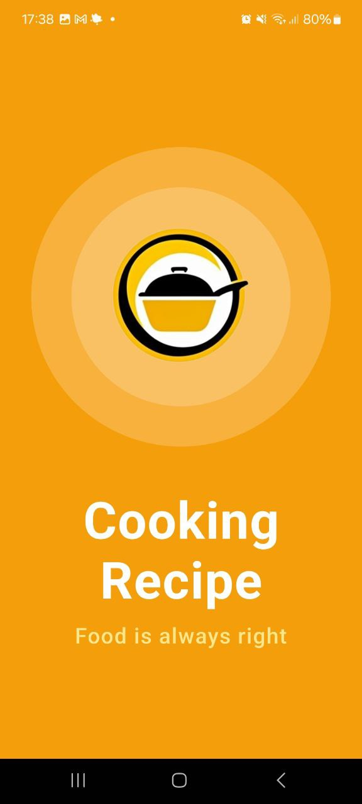
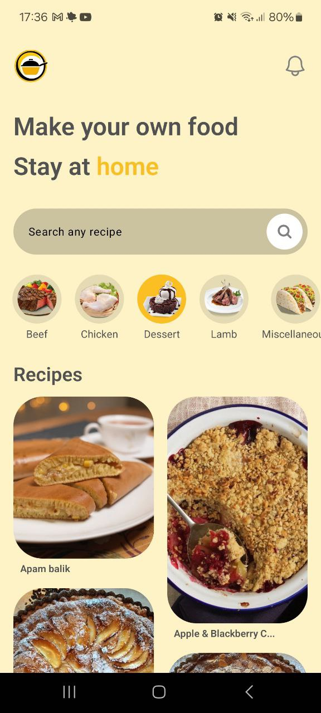
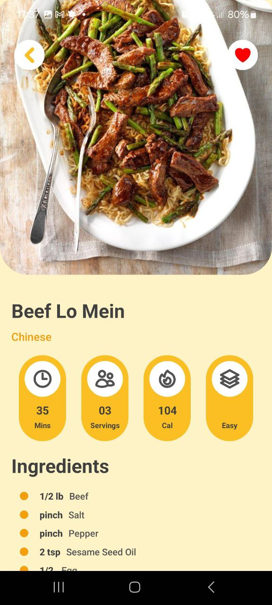
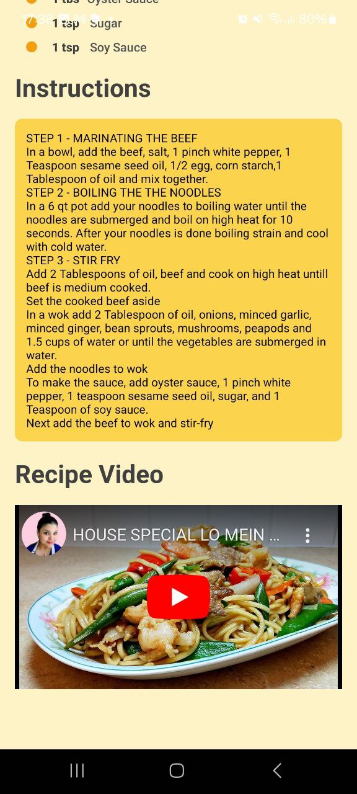

# About the App 

This is a Cooking Recipe App built by `Diego Tech` by using:

- React Native
- Expo

<br />

<div align="left">
  
  
  
  
</div>

<br />

## Libraries I used for the App 🚀

- React Native Async Storage
- React Native Masonry List
- React Native Navigation
- Axios
- Nativewind
- React Native Heroicons
- React Native Reanimated
- React Native SVG
- React Native YouTube Iframe

<br />

### One Message for EveryOne 🔥

> [!TIP]
> ```shell
> Aguante Argentina!!!
> Aguante Messi!!!
> ```
